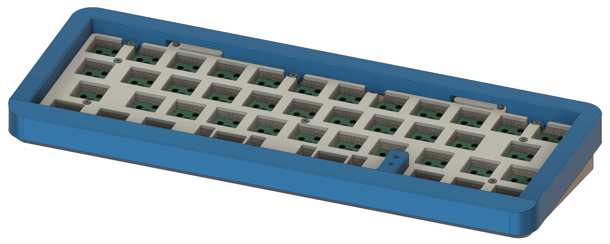
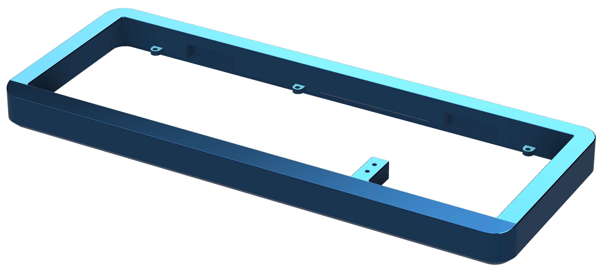
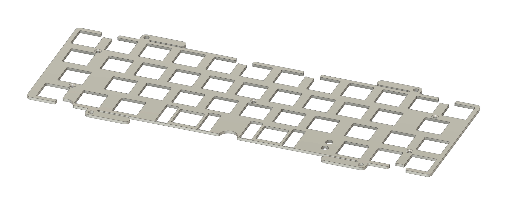
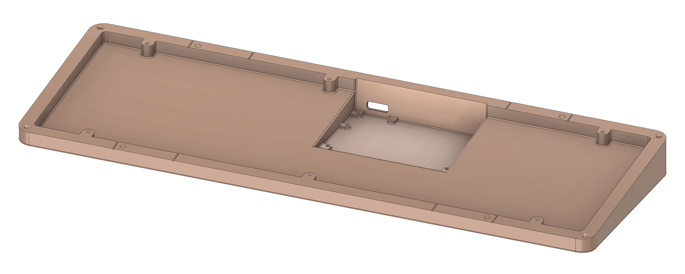
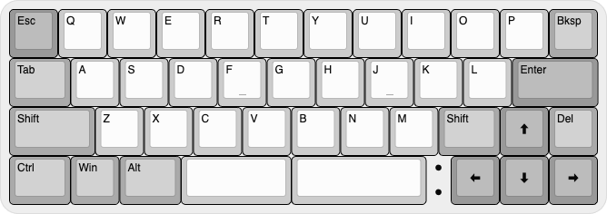
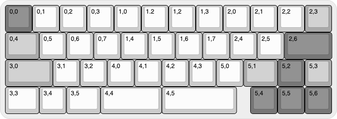
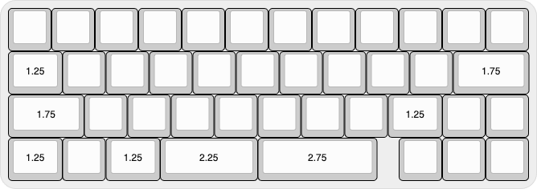

# SR42 Keyboard

A high-speed 40% keyboard

---

   
  <b>Please Note:</b> This project is design complete, but has not been prototyped to validate. Build at your own risk.

---

## Case

<table>
  <tr><td colspan="12" align="center"></td></tr>
  <tr>
    <td colspan="4" align="center"></td>
    <td colspan="4" align="center"></td>
    <td colspan="4" align="center"></td>
  </tr>
</table>

## PCB

<table>
  <tr><td colspan="12" align="center"></td></tr>
  <tr>
    <td colspan="4" align="center"></td>
    <td colspan="4" align="center"></td>
    <td colspan="4" align="center"></td>
  </tr>
</table>
